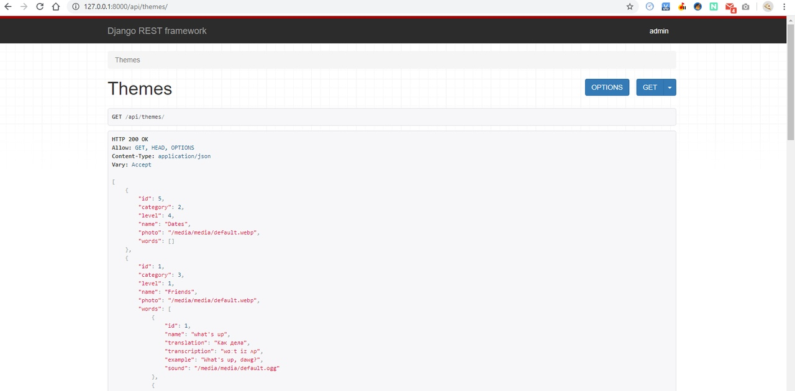
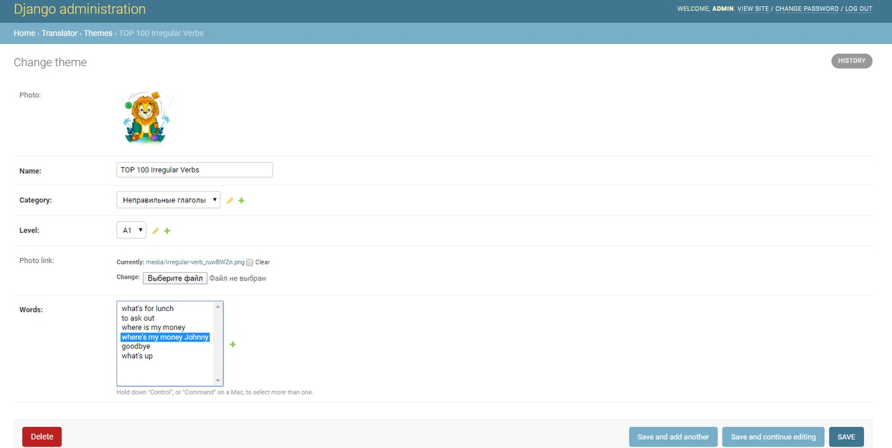
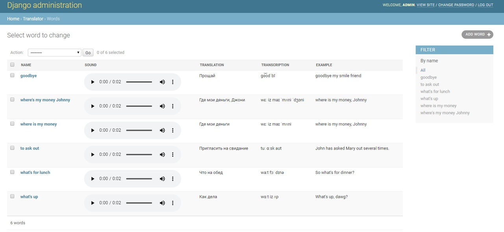
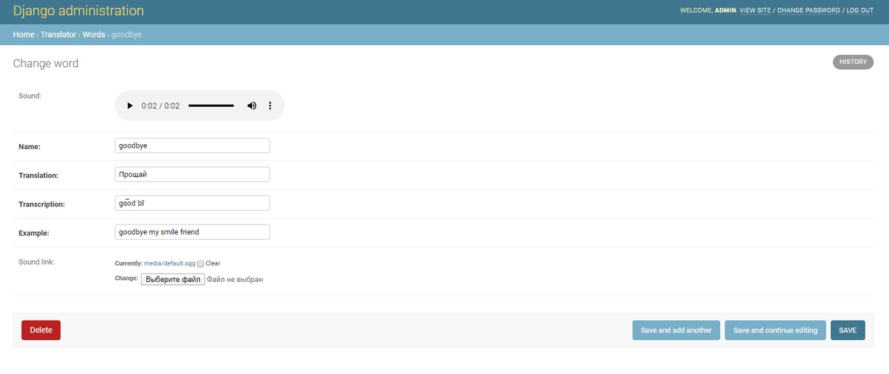
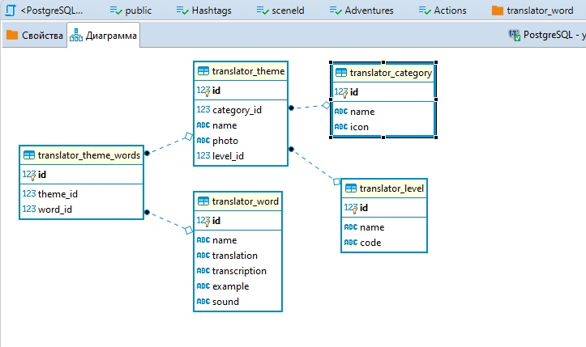

# Doubletapp-Django
REST API и админку для мобильного приложения по изучению
английских слов.

Концепция приложения: существуют разные категории , например People and things,
Appearance and character, Time and dates, они содержат темы (Human body, Face, Things),
которые разделены на уровни владения языком (pre-intermediate, intermediate,
upper_intermediate). В каждой теме есть набор слов.

# Технологии
Python, Django, PostgreSQL (ElephantSQL) и Docker (Compose).

# Сборка
> $ sudo docker-compose build

# Запуск
> $ sudo docker-compose up

# API
Для того, чтобы получить данные по API в заголовке запроса необходимо указать параметр Secret: 755f85c2723bb39381c7379a604160d8.
Иначе, ответом на ваш запрос будет код Http403
  - GET /categories
  - GET /levels
  - GET /themes[ Query params: category: int, level: int ] 
  - GET /themes/{id}
  - GET /words/{id}

Все запросы находятся в папке 'postman'

# Пример GET запроса

# Админ панель
Переходим по адресу: 127.0.0.1:38540/fccda8faefebb2ec17684836d4dd8793011ea79da7244e0e04d2460bef080e3c/
Авторизуемся: admin : ` (login : password)

Имеется возможность редактировать все модели в django-админке.
Для моделей у которых есть изображения, имеется отобразить превью
изображения.
Для моделей у которых есть звуки, существует плеер для проигрывания
звука.

# Пример работы в админ панели

# База данных
Была использована облачная База данных ElephantSQL

# Диаграмма Базы данных

# Общее
Работы была выполнена 28 марта 2020 года.
Ремша Игорь `~(;_._;)~!

>Необходим интерпретатор Python версии не ниже, чем 3.6
